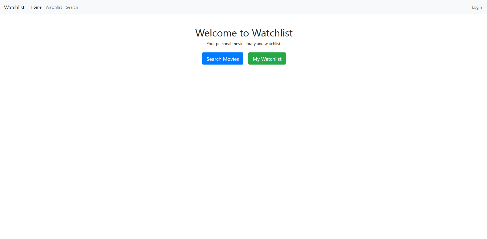
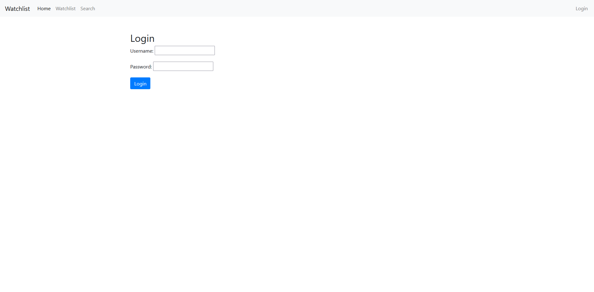
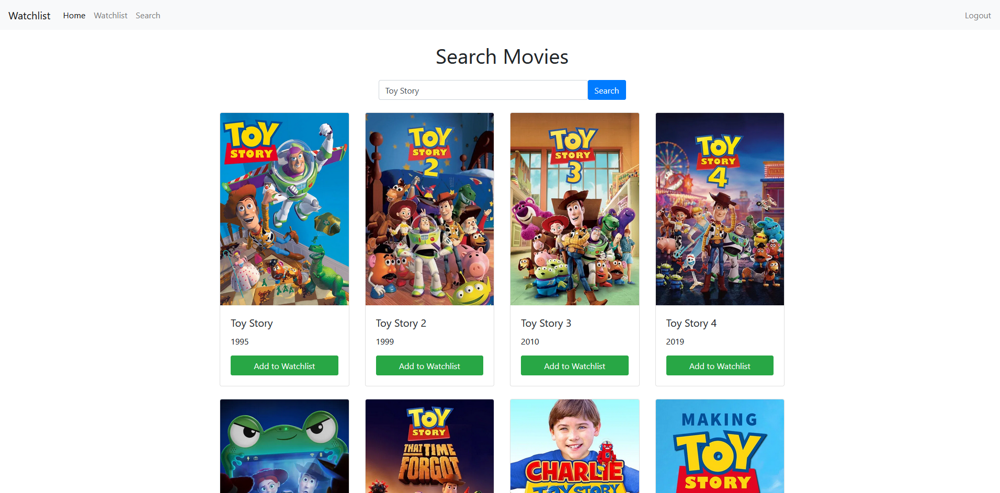
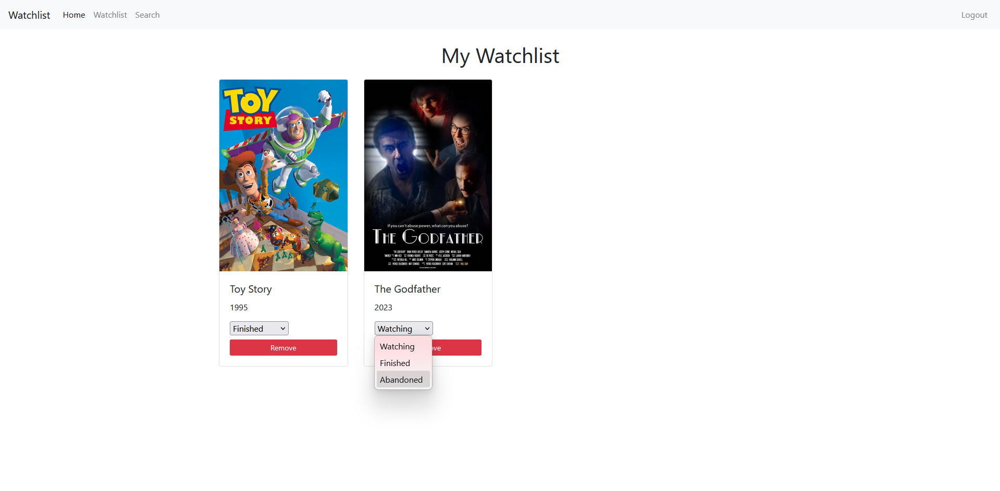

# Watchlist Django Project

A simple Django app where users can add films to a personal watchlist, set their status (Watching / Finished / Abandoned), and manage their list.  
The app uses the **TMDB API** to fetch movie data for search and display.

---

## Watchlist App Features

- Users can add films to their personal watchlist
- Users can remove films from the watchlist
- Each film has a per-user status: Watching / Finished / Abandoned
- Watchlist shows title, year, and status
- Status can be updated directly from the watchlist page
- Movie search powered by TMDB API

## Screenshots

### Home Page

### Login Page

### Search Movies

### Watchlist

